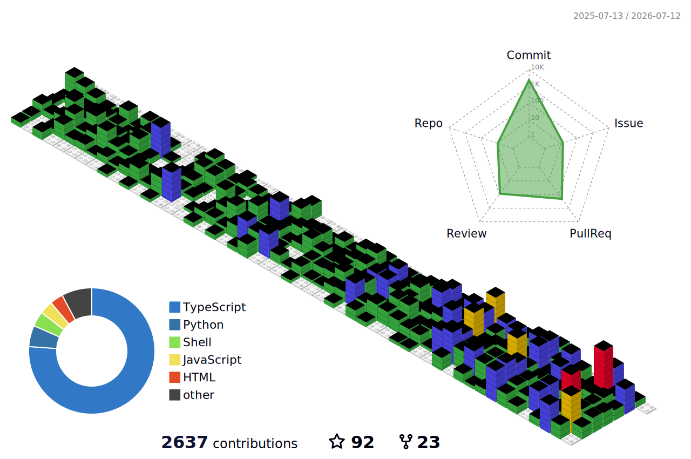

# Francisco Paiva Knebel

Computer Engineer and M.Sc. in Computer Science from the [Federal University of Rio Grande do Sul](https://ufrgs.br) (UFRGS), Brazil.
Coding professionally since 2014 in enterprise-grade software development.

Currently working at [Dawntech Inc.](https://dawntech.dev/).

For personal contact, see 🌐 [franciscoknebel.com](https://franciscoknebel.com).
For business, see 💼 [knebel.inf.br](https://knebel.inf.br)

---

## Groups I support

<table>
  <tr>
    <td align="center" width="120">
      <a href="https://github.com/Open-Digital-Twin">
         
        Open Digital Twin
      </a>
    </td>
    <td align="center" width="120">
      <a href="http://networks.inf.ufrgs.br">
         
        Networks UFRGS
      </a>
    </td>
    <td align="center" width="120">
      <a href="https://www.idejr.com.br">
         
        IDE
      </a>
    </td>
    <td align="center" width="120">
      <a href="https://dawntech.dev">
         
        Dawntech
      </a>
    </td>
  </tr>
</table>

---

## GitHub Stats

## Contributions

---

## Links

