## :robot: &nbsp;About Me

&nbsp;&nbsp;&nbsp;:wave: &nbsp; Hello, my name is **Francisco Paiva Knebel**. \
&nbsp;&nbsp;&nbsp;:technologist: &nbsp; I am a computer engineer, graduated at the brazilian [Federal University of Rio Grande do Sul](https://ufrgs.br) (UFRGS) in 2020. \
&nbsp;&nbsp;&nbsp;:scientist: &nbsp; Currently working on obtaining my Master of Science (M.Sc.) degree in Computer Science at UFRGS. \
&nbsp;&nbsp;&nbsp;:writing_hand: &nbsp; Concurrently, I also work as an [IT Consultant](https://dawntech.dev/consultants/francisco) for [Dawntech Inc.](https://dawntech.dev/). \
&nbsp;&nbsp;&nbsp;:sparkling_heart: &nbsp; Passionate with problem solving and automation.\
&nbsp;&nbsp;&nbsp;:writing_hand: &nbsp; Currently researching Digital Twins and Computer Networks. \
&nbsp;&nbsp;&nbsp;:hammer_and_wrench: &nbsp; Coding professionally since 2014 in enterprise-grade software development.

### :question: Want to know more? [Personal Website](https://franciscoknebel.com)

### :mailbox: How to reach me: <a href="mailto:franciscopaivaknebel@gmail.com">my e-mail address</a>

## :stars: Groups I endorse and support

Open Digital Twin

[https://github.com/Open-Digital-Twin](https://github.com/Open-Digital-Twin)

Computer Networks UFRGS

[http://networks.inf.ufrgs.br](http://networks.inf.ufrgs.br)

IDE

[https://github.com/IDEjr](https://github.com/IDEjr)

Dawntech

[https://github.com/dawntech](https://github.com/dawntech)

## :bouncing_ball_man: Stats

## 🖇 Links

| Professional | |
| --- | --- |
|  | **Personal Website**   [https://franciscoknebel.com](https://franciscoknebel.com) |
|  | **LinkedIn**   [https://www.linkedin.com/in/francisco-knebel-295493111/](https://www.linkedin.com/in/francisco-knebel-295493111/) |
|  | **GitHub**   [https://github.com/FranciscoKnebel](https://github.com/FranciscoKnebel) |

| Academic | |
| --- | --- |
|  | **Lattes**   [http://lattes.cnpq.br/5190590589102587](http://lattes.cnpq.br/5190590589102587) |
|  | **Google Scholar**   [https://scholar.google.com/citations?user=_RHtqxIAAAAJ](https://scholar.google.com/citations?user=_RHtqxIAAAAJ) |
|  | **ResearchGate**   [https://www.researchgate.net/profile/Francisco-Knebel](https://www.researchgate.net/profile/Francisco-Knebel) |
